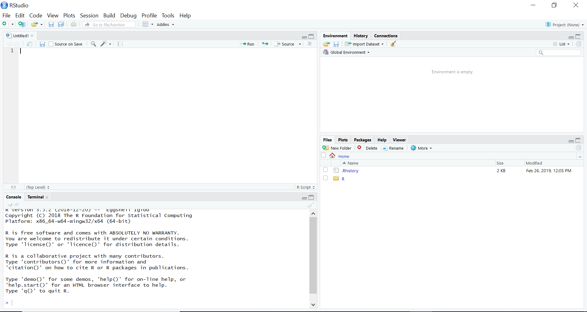

```{r setup, echo = F, message=FALSE}
knitr::opts_chunk$set(echo = FALSE, warning = FALSE, message = FALSE)
options(scipen=9)
set.seed(42)

library(dplyr)
library(stringr)

available_packages <- available.packages(repos = "http://cran.us.r-project.org") %>% as_tibble()


```

# What is R and why should you care

* R is a program for doing statistics and data analysis.
* R's advantages or selling points relative to other programs (e.g, SPSS, SAS, Stata, Minitab,
Python, Matlab, Maple, Mathematica, Tableau, Excel, SQL, and many others) come down to three
inter-related factors:
  * It is immensely powerful.
  * It is open-source.
  * It is very and increasingly widely used.

# R: A power tool for data analysis

The range and depth of statistical analyses and general data analyses that can
be accomplished with R is immense.

* Built into R are virtually the entire repertoire
  of widely known and used statistical methods. 

* Also built in to R is an extensive graphics library.

* R has a vast set of add-on or contributed
  packages. There are presently 
  `r nrow(available_packages)` additional contributed
  packages.  
  
* R is a programming language that is specialized to efficiently
  manipulate and perform calculations on data.  

* The R programming language itself can be extended by interfacing with other
  programming languages like C, C++, Fortran, Python, and high performance computing or big
  data tools like Hadoop, Spark, SQL. 

# R: Open source software

* R is free and open source software, distributed according to the GNU
public license. 
* Likewise, virtually all of contributed R packages are likewise free and open source.
* In practical terms, this means that is freely available for everyone to use, now and forever, on more
or less any device they choose.
* Open source software always has the potential to *go viral* and
develop a large self-sustaining community of user/developers. This has arguably happened with R.

# R: Popularity and widespread use

* When it comes to the computational implementation of modern statistical
methods, R is the de facto standard. For example, the
\href{https://www.jstatsoft.org}{Journal of Statistical Software} is
overwhelmingly dominated by programs written in R.
* R is also currently very highly ranked according to many rankings of
widely used programming languages of any kind. It ranked in the top 10 or top 20 
most widely used programming languages. 
* R is ranked as one of the top five
most popular data science programs in jobs for data scientists, and in
multiple surveys of data scientists, it is often ranked as the first or
second mostly widely used data science tool.

# A guided tour of RStudio

```{r echo=FALSE, out.width='100%'}

```

# Introducing R commands
```{r, echo=FALSE}
knitr::opts_chunk$set(echo = TRUE, prompt = TRUE, warning = FALSE, message = FALSE, comment='#>')

# Thanks to 
# https://github.com/ramnathv/slidify/issues/189#issuecomment-15850008
hook1 <- function(x){ gsub("```\n*```r*\n*", "", x) }
hook2 <- function(x){ gsub("```\n+```\n", "", x) }
knitr::knit_hooks$set(document = hook1)

```

* A useful way to think about R, and not an inaccurate one either, is that it is
simply a calculator.
```{r}
2 + 2 # addition
3 - 5 # subtraction
3 * 2 # multiplication
4 / 3 # division
(2 + 2) ^ (3 / 3.5) # exponents and brackets
```


# Variables and assignment

* If we type the following at the command prompt and then press Enter, the result is displayed but not stored.
```{r}
(12/3.5)^2 + (1/2.5)^3 + (1 + 2 + 3)^0.33
```

* We can, however, assign the value of the above calculation to a variable named `x`.
```{r}
x <- (12/3.5)^2 + (1/2.5)^3 + (1 + 2 + 3)^0.33           
```

* Now, we can use `x` as is it were a number.
```{r}
x
x ^ 2
x * 3.6
```

# Assignment rules

* In general, the assignment rule is 
```
name <- expression
```
The `expression` is any R code that returns some value.

* The `name` must consist of letters, numbers, dots, and underscores. 
``` 
x123   # acceptable
.x
x_y_z
xXx_123
```
* It must begin with a letter or a dot that is not followed by a number. 
``` 
_x   # not acceptable
.2x 
x-y-z
```
* The recommendation is to use names that are
meaningful, relatively short, without dots (using `_` instead for punctuation), and primarily consisting 
of lowercase characters.


# Vectors

* Vectors are one dimensional sequences of values.
* For example, if we want to
create a vector of the first 6 primes numbers, we could do the following.
```{r}
primes <- c(2, 3, 5, 7, 11, 13)
```
* We can now perform operations (arithmetic, logical, etc) on the `primes` vector.
```{r}
primes + 1
primes / 2
primes == 3
primes >= 7
```

# Functions

* In functions, we put data in, calculations or
done to or using this data, and new data, perhaps just a single
value, is then returned.
* There are probably hundreds of thousands of functions in R.
* For example, 
```{r}
length(primes)
sum(primes)
mean(primes)
median(primes)
sd(primes)
var(primes)
```

# Writing R scripts

* Scripts are files where we write R commands, which can be then saved for later
use.
* You can bring up RStudio's script editor with Ctrl+Shift+N, or go to the
File/ New File/ R script, or click on the New icon on the left of
the taskbar below the menu and choose R script.

* In a script, you can have as many lines of code as you wish, and there can be
as many blank lines as you wish.  
```{#numCode .R .numberLines}
composites <- c(4, 6, 8, 9, 10, 12)

composites_plus_one <- composites + 1

composites_minus_one <- composites - 1
```
* If you place the cursor on line 1, you can then click the Run icon, or press the Ctrl+Enter keys.

# Reading in data

* R allows you to import data from a very large
variety of data file types, including from other statistics programs like SPSS,
Stata, SAS, Minitab, and so on, and common file formats like `.xlsx` and `.csv`.

* When learning R initially, the easiest way to import data is using the Import Dataset button in the Environment window.

* If we use the *From Text (readr)...* option, it runs the `read_csv` R command, which we can run ourselves on the command line, or write in a script.

```{r}
library(tidyverse)
weight_df <- read_csv("data/weight.csv")
```

# Viewing data


* The easiest way to view a data frames is to type its name.


```{r}
weight_df
```


# Viewing data (continued)

* Another option to view a data frame is to `glimpse` it.

```{r}
glimpse(weight_df)
```


# Summarizing data with `summary`

* An easy way to summarize a data frame is with `summary`.

```{r}
summary(weight_df)
```
  


# Summarizing with `summarize`

* The `summarize` (or `summarise`) function allows us to calculate summary statistics.
```{r}
summarize(weight_df, 
          mean_weight = mean(weight),
          median_weight = median(weight),
          sd_weight = sd(weight)
)
```


# Summarizing with `summarize` and `group_by`

* Combined with `group_by`, `summarize` allows us to calculate summary statistics by group
```{r}
summarize(group_by(weight_df, gender), 
          mean_weight = mean(weight),
          median_weight = median(weight),
          sd_weight = sd(weight)
)

```


# Plots and data visualiztion

* The best way to data visualization in R is with `ggplot2`, which is part of the `tidyverse`.

* `ggplot2` is a package whose main function is `ggplot`.

* `ggplot` is a *layered* plotting system where we map variables
to aesthetic properties of a graphic and then add layers.


# Scatterplot 

```{r, out.width='0.65\\textwidth',out.extra='keepaspectratio', fig.align='center'}
ggplot(weight_df,
       aes(x = height, y = weight)
) + geom_point()
```

# Scatterplot with `gender` indicated by colour

```{r, out.width='0.65\\textwidth',out.extra='keepaspectratio', fig.align='center'}
ggplot(weight_df,
       aes(x = height, y = weight, col = gender)
) + geom_point()
```


# Scatterplot with line of best fit

```{r, out.width='0.65\\textwidth',out.extra='keepaspectratio', fig.align='center'}
ggplot(weight_df,
       aes(x = height, y = weight)
) + geom_point() + 
  stat_smooth(method = 'lm')
```


# Scatterplot with line of best fit, for each value of `gender`

```{r, out.width='0.65\\textwidth',out.extra='keepaspectratio', fig.align='center'}
ggplot(weight_df,
       aes(x = height, y = weight, col = gender)
) + geom_point() + stat_smooth(method = 'lm')
```

# Changing style of a plot

```{r, out.width='0.65\\textwidth',out.extra='keepaspectratio', fig.align='center'}
ggplot(weight_df,
       aes(x = height, y = weight, col = gender)
) + geom_point() + stat_smooth(method = 'lm') +
  xlab('Height') +
  ylab('Weight') + 
  theme_classic()
```

# Independent samples t-test

* We can use `t.test` for t-tests. 
```{r}
M <- t.test(height ~ gender, data = weight_df)
M
```
* By default, we get the *Welch Two Sample t-test*. Use `var.equal=T` to obtain the independent samples t-test.
```{r}
M <- t.test(height ~ gender, var.equal = T, data = weight_df)
```


# Independent samples t-test


* We can access the attributes of the t-test with e.g.
```{r}
M$statistic
M$parameter
M$p.value
M$conf.in
```


# Correlation

```{r}
cor.test(~ weight + height, data = weight_df)
```

# Spearman's $\rho$

```{r}
cor.test(~ weight + height, 
         method = 'spearman',
         data = weight_df)
```


# Linear regression

```{r}
M <- lm(weight ~ height, data= weight_df)
summary(M)
```

# Prediction in linear regression

```{r}
new_df <- data.frame(height = c(140, 150, 160))
predict(M, newdata = new_df)
```

# Varying intercepts regression

```{r}
M_vi <- lm(weight ~ height + gender, data = weight_df)
summary(M_vi)
```


# Varying slopes regression

```{r}
M_vs <- lm(weight ~ height * gender, data=weight_df)
summary(M_vs)
```


# Model comparison

* Model comparison of the varying intercepts and varying slopes models.
```{r}
anova(M_vi, M_vs)
```


# One-way Anova

```{r}
M <- aov(weight ~ group, data=PlantGrowth)
M
```

# One-way Anova

* We can do Tukey's range test to perform multiple comparisons:
```{r}
TukeyHSD(M)
```

# One way Anova

* Note that we can also we can do Anova using `lm()`:
```{r}
M <- lm(weight ~ group, data=PlantGrowth)
anova(M)
```
